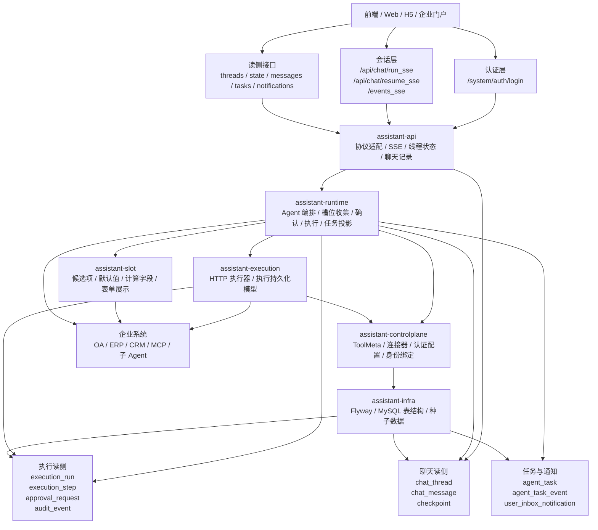

# Assistant Agent 后端架构汇报版

## 1. 系统定位

当前系统已经不是单纯的聊天机器人，而是一套面向企业场景的 `Agent Operating Platform`。

它解决的核心问题有三类：

- 用统一的 `ToolMeta` 契约管理企业动作、查询动作和长任务
- 用稳定的 `SSE` 协议把表单、执行、任务、结果返回给前端
- 用事件投影把聊天、执行、任务、站内信持久化到 MySQL，支持恢复和审计

系统当前适合承载的业务包括：

- 请假申请
- 工作汇报
- 会议室预订
- 异步长任务 / 子 Agent 任务
- 审批中断恢复

## 2. 汇报版总体架构图

## 3. 一次请求的主流程

### 3.1 用户侧流程

1. 前端先调用 `/system/auth/login`
2. 登录后调用 `/api/chat/run_sse`
3. 后端识别业务能力并进入槽位收集
4. 如信息不全，返回 `FORM_STATE`
5. 如信息齐全，返回确认卡
6. 用户确认后进入执行
7. 执行过程中返回 `EXECUTION_PROGRESS / TASK_STATE / RESULT`
8. 聊天记录、线程状态、任务、通知同步落库

### 3.2 恢复流程

1. 前端刷新页面后先读 `state + messages`
2. 若线程未完成，再调用 `resume_sse`
3. 后端直接回放当前卡片或继续推进审批/执行
4. 前端无需重新拼装上下文

## 4. 当前的核心分层

### 4.1 assistant-api

职责：

- 登录代理
- 聊天写接口
- 线程 / 消息 / 状态 / 任务 / 通知读接口
- `SSE` 协议适配
- 聊天记录持久化

关键类：

- `ChatController`
- `V3ProtocolAdapter`
- `ChatTranscriptPersistenceService`
- `ChatThreadStateService`
- `ChatTaskService`

### 4.2 assistant-runtime

职责：

- Agent 编排
- 槽位收集
- 确认卡生成
- 工具执行
- 审批恢复
- 长任务投影

关键类：

- `AssistantAgentFactory`
- `SlotCollectTool`
- `SlotConfirmTool`
- `ArtifactExecuteTool`
- `ArtifactRuntimeExecutor`
- `ExecutionApprovalService`

### 4.3 assistant-slot

职责：

- 读取表单 schema
- 加载候选项
- 自动补默认值
- 计算字段
- 统一表单展示配置

这层决定前端表单是否“后端驱动”。

### 4.4 assistant-execution

职责：

- HTTP 执行步骤模型
- 企业接口调用
- 执行步骤持久化模型

这层是业务动作真正落到企业系统的执行面。

### 4.5 assistant-controlplane

职责：

- 管理 `ToolMeta`
- 管理连接器
- 管理认证配置
- 管理身份绑定
- 管理空间与权限

这层解决“企业如何接入”和“系统如何治理”的问题。

### 4.6 assistant-infra

职责：

- Flyway 迁移
- MySQL 表结构
- 中文表注释 / 字段注释
- 初始化种子数据

## 5. 当前已经具备的功能

### 5.1 聊天与会话能力

- 支持真实登录
- 支持 `run_sse`
- 支持 `resume_sse`
- 支持线程级 `events_sse`
- 支持多轮对话补槽
- 支持待确认、执行中、待审批、完成、失败等正式状态

### 5.2 表单与业务交互能力

- 支持动态表单
- 支持候选项回填
- 支持默认值推荐
- 支持计算字段
- 支持确认卡
- 支持前端修改后再次确认

### 5.3 企业业务能力

已真实联调通过：

- 请假申请
- 工作汇报
- 会议室预订

能力表现：

- 能多轮补信息
- 能自动推荐审批人
- 能自动回填时间范围
- 能真实调用 OA 并完成提交

### 5.4 长任务能力

- 支持后台异步任务
- 支持任务卡折叠展示
- 支持任务中心
- 支持站内信提醒
- 支持任务结果摘要
- 支持线程内实时刷新

### 5.5 持久化与恢复能力

- 聊天线程落库
- 聊天消息落库
- 执行记录落库
- 审批记录落库
- 任务记录落库
- 站内信落库
- 页面刷新后可恢复未完成线程

### 5.6 运维与治理能力

- 连接器治理
- 认证配置治理
- 工具定义治理
- 控制面读写接口
- 审批队列查询
- 执行历史查询
- 事件时间线查询

## 6. 当前系统的亮点

### 6.1 ToolMeta 单一主模型

系统已经收敛到 `ToolMeta` 唯一动作定义，不再依赖多套历史动作模型并存。

价值：

- 接入更简单
- 维护更清晰
- 运行时消费模型更稳定

### 6.2 前后端协议统一

前端只需要处理：

- `STAGE`
- `FORM_STATE`
- `TASK_STATE`
- `EXECUTION_PROGRESS`
- `RESULT`
- `MESSAGE`
- `ERROR`

价值：

- 前端不用猜状态
- 前端不用自己拼企业参数
- 页面刷新可直接恢复

### 6.3 查询型工具与执行型工具分层

系统已经把 resolver 查询工具和用户业务工具分层治理：

- 用户看到业务能力
- 内部 resolver 只给槽位补全和依赖解析使用

价值：

- 降低模型乱调底层查询工具的概率
- 降低前端暴露内部能力的复杂度

### 6.4 事件投影式读侧

聊天、执行、任务、通知都不是散落在不同逻辑里硬写，而是通过统一事件投影产生读侧。

价值：

- 支持恢复
- 支持审计
- 支持任务中心
- 支持站内信

## 7. 当前适合对外怎么介绍

建议外部汇报时把系统定义成：

**企业智能助理后端运行平台**

而不是：

- 单纯聊天机器人
- 单纯 OA 接口封装层
- 单纯工作流系统

更准确的表述是：

> 系统已经具备从“用户登录、会话理解、动态表单、多轮补槽、企业系统执行、异步任务、聊天恢复、审计留痕”到“控制面治理”的完整后端闭环。

## 8. 当前边界

当前已经完成的是企业 API 接入主路线。  
真实外部 MCP / 子 Agent 的 live 集成闭环还没有作为正式生产接入完成，但后端任务协议和回调入口已经具备。

也就是说：

- 平台能力已具备
- 企业 API 业务链已跑通
- 长任务协议已跑通
- 真实外部 MCP 集成仍属于后续扩展项
