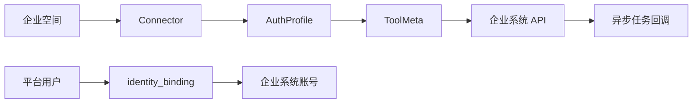

# Assistant Agent 企业接入指南

## 1. 产品定位

当前平台定位是企业 Agent Operating Platform，不是简单聊天机器人。

企业接入的核心不是写 prompt，而是完成四件事：

- 把企业系统接成标准连接器
- 把业务能力定义成类型化工具
- 把平台用户身份和企业用户身份绑定起来
- 对异步长任务提供标准回调

当前推荐路线是 `API-first`：

- 优先接企业 HTTP 接口
- 查询型能力独立成 `QUERY` 工具
- 写操作统一走 `executionPlan`
- 内部 resolver 工具不暴露给最终用户
- 异步任务统一走 `AGENT_TASK + TASK_STATE`

## 2. 接入总览

企业接入通常分五步：

1. 创建 `Connector`
2. 创建 `AuthProfile`
3. 创建 `ToolMeta`
4. 配置 `identity_binding`
5. 如果有长任务，再接内部回调协议



## 3. 标准模型

### 3.1 Connector

Connector 表示一个企业系统接入点，建议一个系统一个 Connector。

关键字段：

- `spaceCode`
- `connectorCode`
- `systemCode`
- `displayName`
- `protocolType`
- `networkZone`
- `baseUrl`
- `status`

### 3.2 AuthProfile

AuthProfile 表示如何拿到企业系统 token。

关键字段：

- `authProfileCode`
- `authType`
- `usagePolicy`
- `tokenEndpoint`
- `tokenHeaderName`
- `tokenHeaderPrefix`
- `audience`
- `scopes`
- `credentialRef`
- `refreshPolicy`

### 3.3 ToolMeta

ToolMeta 是唯一动作定义模型。除了业务字段，还需要显式治理维度：

- `toolType = QUERY | ACTION | WORKFLOW | AGENT_TASK`
- `visibility = USER | PLANNER | INTERNAL`
- `invocationPolicy = DIRECT | COMPOSABLE | DEPENDENCY_ONLY`
- `executionMode = SYNC | ASYNC`

## 4. 推荐的工具分层

### 4.1 用户工具

用户真正能在对话里发起的业务能力：

- `gougu_oa.leave_application`
- `gougu_oa.meeting_room_booking`
- `gougu_oa.work_report`

推荐设置：

- `visibility = USER`
- `invocationPolicy = DIRECT`

### 4.2 查询工具

可复用查询能力：

- `gougu_oa.user_directory`
- `gougu_oa.leave_type_options`
- `gougu_oa.approver_candidates`

如果这些工具只服务槽位补全，不希望出现在用户工具列表里，则设置：

- `visibility = INTERNAL`
- `invocationPolicy = DEPENDENCY_ONLY`

### 4.3 为什么要这么分层

这样做的好处：

- 模型不会把内部 resolver 误当成用户任务去执行
- 前端只看到真正有业务意义的工具和任务
- 查询能力可复用、可缓存、可审计
- 企业接入时不需要在每个字段里重复写接口地址

## 5. 参数定义最佳实践

### 5.1 槽位候选项必须走查询工具

不要这样做：

- 在字段里直接写接口地址
- 为每个表单字段重复配置一套请求逻辑

请这样做：

- 先定义一个 `QUERY` 工具
- 再在业务工具的 `parameterSchema` 中通过 `options.source = TOOL` 引用

示例：

```json
{
  "name": "check_uids",
  "type": "string",
  "title": "审批人",
  "uiComponent": "select",
  "options": {
    "source": "TOOL",
    "tool": {
      "toolCode": "gougu_oa.approver_candidates",
      "resultPath": "data",
      "labelField": "name",
      "valueField": "id",
      "descriptionField": "department"
    }
  }
}
```

### 5.2 写操作必须走 executionPlan

标准做法：

- 一个 `ACTION` 对应单次写操作
- 一个 `WORKFLOW` 对应多步骤流程
- 每一步都明确 `method / endpoint / inputMapping / outputMapping / successCondition`

## 6. InteractionPolicy 推荐写法

### 6.1 用户可见工作流

```json
{
  "toolType": "WORKFLOW",
  "visibility": "USER",
  "invocationPolicy": "DIRECT",
  "executionMode": "SYNC",
  "collect": {
    "batch_size": 4,
    "max_rounds": 5
  },
  "confirm": {
    "enabled": true,
    "allow_edit": true
  }
}
```

### 6.2 内部查询型 resolver

```json
{
  "toolType": "QUERY",
  "visibility": "INTERNAL",
  "invocationPolicy": "DEPENDENCY_ONLY",
  "executionMode": "SYNC",
  "cacheScope": "REQUEST"
}
```

### 6.3 异步长任务

```json
{
  "toolType": "AGENT_TASK",
  "visibility": "USER",
  "invocationPolicy": "DIRECT",
  "executionMode": "ASYNC"
}
```

## 7. 身份绑定

平台登录成功不等于企业系统登录成功。

还必须具备：

- `identity_binding`
- `system_access_profile`

运行时会根据：

- 当前平台登录用户
- 当前 `systemCode`
- `identity_binding`
- `system_access_profile`

完成 token exchange 或用户级凭证代理。

## 8. 长任务与子 Agent

如果企业场景里存在：

- 报表生成
- 数据分析
- MCP 长耗时调用
- 子 agent 异步执行

建议直接建模成 `AGENT_TASK`，不要继续塞在普通聊天文本里。

这样做的结果是：

- 聊天里显示折叠任务卡
- 任务中心可以独立查看
- 任务完成后自动发站内信
- 点击通知可回到线程或查看结果

推荐语义：

- `background=true`：后台执行，不阻塞主对话
- `detached=true`：允许在聊天中折叠展示
- `action.type=TASK_DETAIL`：统一跳任务详情

## 9. 异步回调协议

### 9.1 接口

企业子系统、子 agent 或 MCP 完成后台任务后，应调用：

- `POST /system/internal/chat/tasks/events`

请求头：

- `X-Assistant-Callback-Token: <callback-token>`

这个 token 由平台运维方配置在：

- `assistant.chat.internal-callback-token`

### 9.2 请求体

```json
{
  "threadId": "live-openclow-20260315-221745-async-task-002",
  "assistantUid": "1",
  "appName": "assistant-ui",
  "systemCode": "gougu_oa",
  "turnId": "turn-async-20260315-221745",
  "task": {
    "taskId": "TASK-ASYNC-20260315-221745",
    "taskType": "SUB_AGENT_CALL",
    "sourceType": "SUB_AGENT",
    "sourceCode": "mcp:data-agent",
    "title": "销售分析长任务",
    "status": "IN_PROGRESS",
    "progressPercent": 40,
    "background": true,
    "detached": true,
    "collapsible": true,
    "liveOutput": [
      {
        "eventType": "PROGRESS",
        "text": "已完成 2/5 批",
        "occurredAt": "2026-03-15T14:17:47Z"
      }
    ]
  }
}
```

### 9.3 终态回调

任务完成时再次回调，至少补齐：

- `status = COMPLETED` 或 `FAILED`
- `resultReady = true`
- `resultPreview`
- `resultPreview.summary` 或 `resultPreview.text`，平台会把它作为终态 `summaryText`、线程摘要和站内信详情预览的优先来源
- `notification`

示例：

```json
{
  "threadId": "live-openclow-20260315-221745-async-task-002",
  "assistantUid": "1",
  "appName": "assistant-ui",
  "systemCode": "gougu_oa",
  "turnId": "turn-async-20260315-221745",
  "task": {
    "taskId": "TASK-ASYNC-20260315-221745",
    "taskType": "SUB_AGENT_CALL",
    "sourceType": "SUB_AGENT",
    "sourceCode": "mcp:data-agent",
    "title": "销售分析长任务",
    "status": "COMPLETED",
    "resultReady": true,
    "background": true,
    "detached": true,
    "resultPreview": {
      "reportId": "R-ASYNC-002",
      "summary": "销售额同比增长 12%"
    },
    "notification": {
      "notificationId": "N-20260315-221745",
      "title": "销售分析已完成",
      "body": "点击查看长任务结果"
    }
  }
}
```

### 9.4 平台行为

回调成功后，平台会自动：

- 生成标准化 `TASK_STATE`
- 在任务终态时追加 `RESULT`
- 写入 `chat_thread / chat_message`
- 写入 `agent_task / agent_task_event`
- 写入 `user_inbox_notification`
- 通过 `/api/chat/threads/{threadId}/events_sse` 推送实时增量事件

## 10. 企业方需要提供的最少能力

建议最少提供：

- 用户登录或 token 交换能力
- 至少一组只读查询接口
- 至少一组写操作接口
- 稳定的错误码和返回体
- 如果存在后台任务，提供明确的回调触发点

推荐返回结构：

```json
{
  "code": 0,
  "msg": "success",
  "data": {}
}
```

## 11. 周期型业务最佳实践

对于日报、周报、月报、请假周期、统计周期这类场景，推荐采用“类型优先 + schema 计算字段”的模式：

- 先让用户选择类型
- 再由后端根据类型自动推导默认时间范围
- 前端只负责展示和允许用户覆盖
- 真正提交字段由后端统一装配

工作汇报是当前标准示例：

- `types=1` -> 日报
- `types=2` -> 周报
- `types=3` -> 月报
- `start_date/end_date` 由 `period_preset` 自动推导
- `range_date` 由 `date_range_label` 自动生成
- `submit_range_date` 由 `selector_switch` 自动决定是否参与提交

## 12. 验收清单

企业系统进入联调前，至少满足：

- 连接器地址正确
- token 交换能力已验证
- 查询接口返回稳定
- 写接口可在测试账号下成功调用
- 用户绑定策略明确
- 至少一条完整同步业务链已走通
- 如果有长任务，至少一条异步回调链已走通

## 13. 不推荐的接入方式

不要再这样做：

- 在字段里直接写临时 API 地址
- 把内部 resolver 工具暴露给最终用户
- 用 prompt 临时约定接口参数
- 让前端自行拼装企业写接口请求体
- 把长任务输出混在普通聊天消息里
- 后台任务完成后只写日志，不回调平台

## 14. 默认空间

迁移模式默认使用：

- `space_code=default`
- `environment=prod`

如果企业接入方没有显式传递空间上下文，后端会自动回退到默认空间，并把解析后的 `space_id / space_code / space_environment` 写入执行态和聊天状态。


