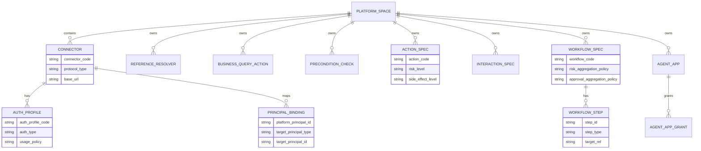
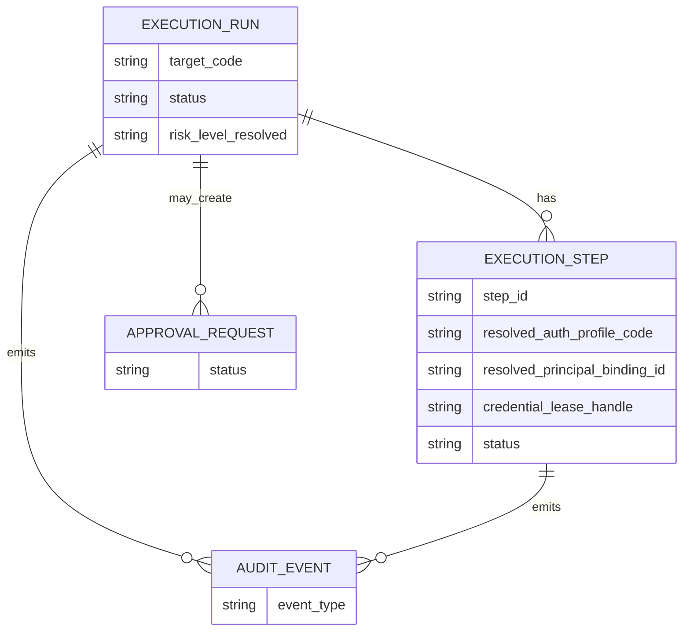
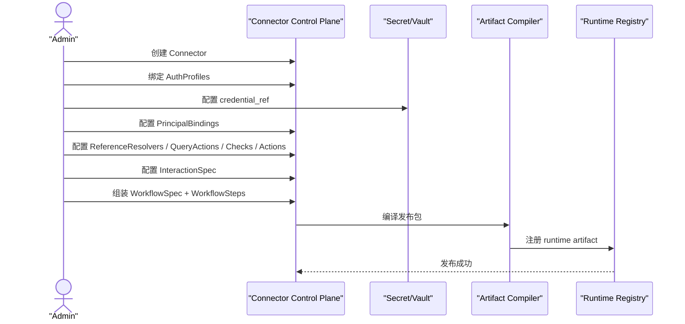
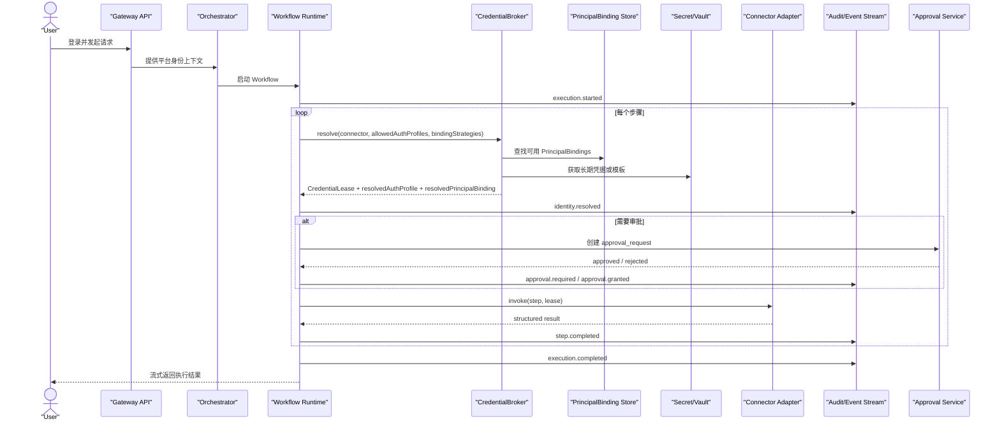

# 企业私有化 OpenClaw 平台控制面 Schema 与时序设计

> 日期：2026-03-10
> 适用项目：`D:/devfive/AssistantAgent`
> 前置文档：`docs/plans/2026-03-10-enterprise-private-openclaw-platform-design.md`
> 目标：给出控制面逻辑表结构草案、对象关系图，以及设计态/运行态时序图，作为后续控制面与运行时改造的基线。

---

## 1. 设计定位

这份文档不是最终 DDL，而是逻辑 Schema 设计。

原则如下：

1. 先定义稳定领域对象，再决定物理存储。
2. 私有化部署场景下，一个企业通常对应一套部署实例，不做跨企业 SaaS 级租户建模。
3. 设计态对象与运行态对象严格分离。
4. 长期凭据与短期 Lease 分离。
5. 控制面定义不直接暴露为运行时最终结果，运行时必须保留解析痕迹。

---

## 2. 存储分层建议

### 2.1 MySQL / PostgreSQL：控制面主存储

适合持久化以下对象：

1. `platform_space`
2. `connector`
3. `auth_profile`
4. `principal_binding`
5. `reference_resolver`
6. `business_query_action`
7. `precondition_check`
8. `action_spec`
9. `interaction_spec`
10. `workflow_spec`
11. `workflow_step`
12. `agent_app`
13. `agent_app_grant`
14. `approval_policy`

### 2.2 Redis：短期运行态与 Lease

适合存储：

1. `credential_lease`
2. 执行中工作流状态
3. 暂停/恢复上下文
4. 短期引用数据缓存

### 2.3 事件存储 / 审计库

适合存储：

1. `audit_event`
2. `execution_event`
3. `approval_event`

### 2.4 对象存储

适合存储：

1. 导入的 OpenAPI 原文
2. 运行时编译产物
3. 工作流发布包
4. 回放附件和诊断快照

---

## 3. 术语与边界

### 3.1 私有化术语

1. `enterprise`：客户企业实体。
2. `deployment`：该企业的一套私有化平台实例。
3. `environment`：`dev / test / prod`。
4. `space`：企业实例内部逻辑隔离空间，例如事业部、业务线、品牌、区域。
5. `tenantId`：仅为兼容当前仓库旧表结构保留的逻辑字段，不再作为产品核心语义。

### 3.2 设计态对象

设计态对象用于定义平台能力：

1. Connector
2. AuthProfile
3. PrincipalBinding
4. ReferenceResolver
5. BusinessQueryAction
6. PreconditionCheck
7. ActionSpec
8. InteractionSpec
9. WorkflowSpec
10. AgentApp

### 3.3 运行态对象

运行态对象用于记录一次真实执行结果：

1. ExecutionRun
2. ExecutionStep
3. ApprovalRequest
4. CredentialLease
5. AuditEvent

---

## 4. 控制面逻辑表结构草案

## 4.1 空间与接入域

### `platform_space`

用途：企业实例内部的逻辑隔离边界。

| 字段 | 类型建议 | 说明 |
|---|---|---|
| `id` | bigint / uuid | 主键 |
| `space_code` | varchar | 空间编码，唯一 |
| `space_name` | varchar | 空间名称 |
| `environment` | varchar | `dev/test/prod` |
| `status` | varchar | `active/inactive` |
| `created_at` | datetime | 创建时间 |
| `updated_at` | datetime | 更新时间 |

说明：

1. 一个部署实例至少有一个 `platform_space`。
2. 后续所有控制面对象默认挂到 `space_id` 下。

### `connector`

用途：描述一个目标系统。

| 字段 | 类型建议 | 说明 |
|---|---|---|
| `id` | bigint / uuid | 主键 |
| `space_id` | fk | 所属空间 |
| `connector_code` | varchar | 连接器编码，空间内唯一 |
| `system_code` | varchar | 兼容旧模型的系统码 |
| `display_name` | varchar | 展示名 |
| `protocol_type` | varchar | `openapi/mcp/http/sdk/sql` |
| `environment` | varchar | 目标环境 |
| `network_zone` | varchar | `intranet/loopback/dmz` |
| `base_url` | varchar | 目标系统基地址 |
| `status` | varchar | `draft/enabled/disabled` |
| `version` | int | 版本号 |
| `created_at` | datetime | 创建时间 |
| `updated_at` | datetime | 更新时间 |

说明：

1. `system_code` 仅作为兼容字段保留。
2. 平台运行时应优先使用 `connector_code` / `connector_id`。

### `auth_profile`

用途：描述同一 Connector 的一种认证方式。

| 字段 | 类型建议 | 说明 |
|---|---|---|
| `id` | bigint / uuid | 主键 |
| `space_id` | fk | 所属空间 |
| `connector_id` | fk | 所属连接器 |
| `auth_profile_code` | varchar | 认证编码 |
| `auth_type` | varchar | `oauth_cc/oidc/api_key/session/jwt_assertion/mtls` |
| `usage_policy` | varchar | `read_only/mutate/approval/admin` |
| `token_endpoint` | varchar | 可为空 |
| `token_header_name` | varchar | 例如 `Authorization` |
| `token_header_prefix` | varchar | 例如 `Bearer ` |
| `audience` | varchar | 目标 audience |
| `scopes_json` | json | 作用域集合 |
| `credential_ref` | varchar | 指向 Vault / Secret Manager |
| `refresh_policy_json` | json | 刷新策略 |
| `status` | varchar | `draft/enabled/disabled` |
| `created_at` | datetime | 创建时间 |
| `updated_at` | datetime | 更新时间 |

说明：

1. 一个 Connector 必须允许多个 AuthProfile。
2. Action 与 Workflow Step 应引用“候选集”，不能只写死单个 AuthProfile。

### `principal_binding`

用途：定义平台主体到目标系统主体的映射。

| 字段 | 类型建议 | 说明 |
|---|---|---|
| `id` | bigint / uuid | 主键 |
| `space_id` | fk | 所属空间 |
| `connector_id` | fk | 所属连接器 |
| `platform_principal_id` | varchar | 平台用户/机器人/部门主体 |
| `platform_principal_type` | varchar | `user/bot/group/service` |
| `target_principal_type` | varchar | `user/service_account/bot/delegated_user` |
| `target_principal_id` | varchar | 目标系统主体标识 |
| `scope_constraints_json` | json | 限制范围 |
| `priority` | int | 绑定优先级 |
| `status` | varchar | `active/inactive` |
| `created_at` | datetime | 创建时间 |
| `updated_at` | datetime | 更新时间 |

说明：

1. 同一个平台用户可以在不同 Connector 上有不同绑定。
2. 同一 Connector 也可以存在多条绑定，由策略和优先级决定实际选用哪条。

## 4.2 查询、校验、动作与交互域

### `reference_resolver`

用途：只读引用数据查询器，不直接作为高层业务动作暴露。

| 字段 | 类型建议 | 说明 |
|---|---|---|
| `id` | bigint / uuid | 主键 |
| `space_id` | fk | 所属空间 |
| `resolver_code` | varchar | 编码 |
| `connector_id` | fk | 所属连接器 |
| `allowed_auth_profiles_json` | json | 候选认证集合 |
| `input_schema_json` | json | 输入 schema |
| `output_schema_json` | json | 输出 schema |
| `cache_policy_json` | json | 缓存策略 |
| `staleness_policy_json` | json | 过期策略 |
| `visibility` | varchar | `internal/shared` |
| `status` | varchar | 状态 |
| `created_at` | datetime | 创建时间 |
| `updated_at` | datetime | 更新时间 |

### `business_query_action`

用途：可面向用户直接暴露的业务查询动作。

| 字段 | 类型建议 | 说明 |
|---|---|---|
| `id` | bigint / uuid | 主键 |
| `space_id` | fk | 所属空间 |
| `query_action_code` | varchar | 编码 |
| `connector_id` | fk | 所属连接器 |
| `allowed_auth_profiles_json` | json | 候选认证集合 |
| `binding_strategies_json` | json | 主体策略集合 |
| `input_schema_json` | json | 输入 schema |
| `output_schema_json` | json | 输出 schema |
| `risk_level` | varchar | 风险等级，通常低 |
| `result_visibility_policy_json` | json | 返回可见性策略 |
| `status` | varchar | 状态 |
| `created_at` | datetime | 创建时间 |
| `updated_at` | datetime | 更新时间 |

### `precondition_check`

用途：工作流内部前置校验节点。

| 字段 | 类型建议 | 说明 |
|---|---|---|
| `id` | bigint / uuid | 主键 |
| `space_id` | fk | 所属空间 |
| `check_code` | varchar | 编码 |
| `connector_id` | fk | 所属连接器 |
| `allowed_auth_profiles_json` | json | 候选认证集合 |
| `binding_strategies_json` | json | 主体策略集合 |
| `input_schema_json` | json | 输入 schema |
| `check_expression_json` | json | 校验表达式 |
| `failure_policy_json` | json | 失败策略 |
| `status` | varchar | 状态 |
| `created_at` | datetime | 创建时间 |
| `updated_at` | datetime | 更新时间 |

### `action_spec`

用途：原子业务写动作。

| 字段 | 类型建议 | 说明 |
|---|---|---|
| `id` | bigint / uuid | 主键 |
| `space_id` | fk | 所属空间 |
| `action_code` | varchar | 编码 |
| `connector_id` | fk | 所属连接器 |
| `allowed_auth_profiles_json` | json | 候选认证集合 |
| `default_auth_profile_code` | varchar | 可选默认值 |
| `binding_strategies_json` | json | 主体策略集合 |
| `input_schema_json` | json | 输入 schema |
| `output_schema_json` | json | 输出 schema |
| `idempotency_policy_json` | json | 幂等策略 |
| `risk_level` | varchar | 风险等级 |
| `approval_policy_id` | fk | 审批策略 |
| `side_effect_level` | varchar | `none/write/high_impact` |
| `observability_profile_json` | json | 观测配置 |
| `status` | varchar | 状态 |
| `version` | int | 版本 |
| `created_at` | datetime | 创建时间 |
| `updated_at` | datetime | 更新时间 |

### `interaction_spec`

用途：表单、槽位、确认规则。

| 字段 | 类型建议 | 说明 |
|---|---|---|
| `id` | bigint / uuid | 主键 |
| `space_id` | fk | 所属空间 |
| `interaction_code` | varchar | 编码 |
| `slot_schema_json` | json | 槽位定义 |
| `ask_strategy_json` | json | 收集策略 |
| `auto_fill_rules_json` | json | 自动补全规则 |
| `summary_layout_json` | json | 摘要展示规则 |
| `confirmation_policy_json` | json | 确认策略 |
| `edit_policy_json` | json | 编辑策略 |
| `status` | varchar | 状态 |
| `created_at` | datetime | 创建时间 |
| `updated_at` | datetime | 更新时间 |

## 4.3 工作流与发布域

### `workflow_spec`

用途：描述一个组合业务能力。

| 字段 | 类型建议 | 说明 |
|---|---|---|
| `id` | bigint / uuid | 主键 |
| `space_id` | fk | 所属空间 |
| `workflow_code` | varchar | 编码 |
| `display_name` | varchar | 展示名 |
| `interaction_spec_id` | fk | 可选表单定义 |
| `risk_aggregation_policy` | varchar | 例如 `max_step_risk` |
| `approval_aggregation_policy` | varchar | 例如 `strictest_step_policy` |
| `failure_policy_json` | json | 失败策略 |
| `audit_policy_json` | json | 审计策略 |
| `status` | varchar | 状态 |
| `version` | int | 版本 |
| `published_artifact_ref` | varchar | 编译产物引用 |
| `created_at` | datetime | 创建时间 |
| `updated_at` | datetime | 更新时间 |

### `workflow_step`

用途：描述工作流中的单个步骤。

| 字段 | 类型建议 | 说明 |
|---|---|---|
| `id` | bigint / uuid | 主键 |
| `workflow_id` | fk | 所属工作流 |
| `step_id` | varchar | 步骤编码 |
| `step_name` | varchar | 步骤名 |
| `step_type` | varchar | `reference_resolve/business_query/precondition_check/action/approval_gate/transform` |
| `connector_id` | fk | 所属连接器 |
| `target_ref` | varchar | 指向 resolver/action/check 等编码 |
| `allowed_auth_profiles_json` | json | 候选认证集合 |
| `binding_strategies_json` | json | 主体策略集合 |
| `input_mapping_json` | json | 输入映射 |
| `output_mapping_json` | json | 输出映射 |
| `depends_on_json` | json | 依赖步骤 |
| `condition_json` | json | 执行条件 |
| `join_policy_json` | json | 汇聚策略 |
| `retry_policy_json` | json | 重试策略 |
| `timeout_policy_json` | json | 超时策略 |
| `approval_gate_json` | json | 审批门禁 |
| `compensation_target_ref` | varchar | 补偿动作 |
| `resume_policy_json` | json | 恢复策略 |
| `step_order` | int | 展示顺序 |
| `status` | varchar | 状态 |

### `agent_app`

用途：面向用户暴露的 agent 应用定义。

| 字段 | 类型建议 | 说明 |
|---|---|---|
| `id` | bigint / uuid | 主键 |
| `space_id` | fk | 所属空间 |
| `agent_app_code` | varchar | 编码 |
| `display_name` | varchar | 展示名 |
| `prompt_policy_json` | json | Prompt 策略 |
| `memory_policy_json` | json | 记忆策略 |
| `approval_strategy_json` | json | 审批策略 |
| `status` | varchar | 状态 |
| `created_at` | datetime | 创建时间 |
| `updated_at` | datetime | 更新时间 |

### `agent_app_grant`

用途：定义 AgentApp 可以访问哪些 Workflow / Action / Query。

| 字段 | 类型建议 | 说明 |
|---|---|---|
| `id` | bigint / uuid | 主键 |
| `agent_app_id` | fk | AgentApp |
| `target_type` | varchar | `workflow/action/query/resolver` |
| `target_code` | varchar | 目标编码 |
| `grant_mode` | varchar | `allow/deny` |
| `constraints_json` | json | 附加约束 |

---

## 5. 运行态逻辑表结构草案

### `execution_run`

用途：一次真实执行。

| 字段 | 类型建议 | 说明 |
|---|---|---|
| `id` | bigint / uuid | 主键 |
| `space_id` | fk | 所属空间 |
| `agent_app_code` | varchar | 发起应用 |
| `execution_type` | varchar | `workflow/action/query` |
| `target_code` | varchar | 目标编码 |
| `platform_principal_id` | varchar | 发起主体 |
| `thread_id` | varchar | 会话线程 |
| `status` | varchar | `pending/running/paused/succeeded/failed/cancelled` |
| `risk_level_resolved` | varchar | 本次执行最终风险等级 |
| `approval_state` | varchar | 审批状态 |
| `started_at` | datetime | 开始时间 |
| `completed_at` | datetime | 完成时间 |
| `created_at` | datetime | 创建时间 |

### `execution_step`

用途：一次执行中的步骤快照与解析结果。

| 字段 | 类型建议 | 说明 |
|---|---|---|
| `id` | bigint / uuid | 主键 |
| `execution_run_id` | fk | 所属执行 |
| `step_id` | varchar | 步骤编码 |
| `step_type` | varchar | 步骤类型 |
| `connector_id` | fk | 实际连接器 |
| `target_ref` | varchar | 目标动作/查询/校验 |
| `allowed_auth_profiles_json` | json | 设计态候选集合快照 |
| `resolved_auth_profile_code` | varchar | 运行态解析结果 |
| `resolved_principal_binding_id` | varchar | 运行态主体映射 |
| `credential_lease_handle` | varchar | 步骤使用的 Lease 句柄 |
| `status` | varchar | 步骤状态 |
| `input_snapshot_json` | json | 输入快照 |
| `output_snapshot_json` | json | 输出快照 |
| `error_snapshot_json` | json | 错误快照 |
| `started_at` | datetime | 开始时间 |
| `completed_at` | datetime | 完成时间 |

### `approval_request`

用途：工作流或动作审批请求。

| 字段 | 类型建议 | 说明 |
|---|---|---|
| `id` | bigint / uuid | 主键 |
| `execution_run_id` | fk | 所属执行 |
| `execution_step_id` | fk | 所属步骤，可为空 |
| `approval_policy_id` | fk | 命中的审批策略 |
| `status` | varchar | `pending/approved/rejected/expired` |
| `request_payload_json` | json | 审批内容 |
| `decision_payload_json` | json | 审批决定 |
| `requested_at` | datetime | 发起时间 |
| `decided_at` | datetime | 决策时间 |

### `audit_event`

用途：统一审计事件流。

| 字段 | 类型建议 | 说明 |
|---|---|---|
| `id` | bigint / uuid | 主键 |
| `execution_run_id` | fk | 所属执行 |
| `execution_step_id` | fk | 所属步骤，可为空 |
| `event_type` | varchar | 事件类型 |
| `event_payload_json` | json | 事件内容 |
| `occurred_at` | datetime | 发生时间 |

说明：

1. `credential_lease` 不建议作为长期关系表主存储。
2. Lease 更适合放在 Redis，数据库只保留 `lease_handle` 与解析痕迹。

---

## 6. 关系图

### 6.1 控制面对象关系



### 6.2 运行态对象关系



---

## 7. 设计态与运行态时序图

### 7.1 设计态：定义并发布一个工作流



说明：

1. 控制面定义的是候选认证、绑定策略、风险和工作流。
2. 编译产物才会被运行时直接消费。
3. `ToolMeta` 可以作为兼容运行时产物存在，但不再是人工配置主入口。

### 7.2 运行态：执行一个多系统工作流



说明：

1. `allowedAuthProfiles` 是设计态快照。
2. `resolvedAuthProfile` 是本次执行真实选中的结果。
3. Lease 不跨 Connector 共享。
4. 审批与认证解析都必须出现在事件流中。

---

## 8. 旧模型到新模型的迁移映射

| 旧对象 | 新对象 | 说明 |
|---|---|---|
| `assistant_capability_registry` | `interaction_spec + workflow_spec + workflow_step + action_spec + reference_resolver` | 需要拆层，不能再一表承载全部语义 |
| `tool_meta` | `runtime artifact` | 从控制面主对象退化为编译产物 |
| `system_access_profile` | `connector + auth_profile` | 系统接入和认证模板分离 |
| `identity_binding` | `principal_binding` | 从简单绑定升级为多主体映射 |
| `executionPlan` | `workflow_spec + workflow_step` | 设计态对象化 |
| `behavior_strategy` | `interaction_spec + policy_pack` | 交互与治理分离 |

---

## 9. `leave_application` 样例落图

### 9.1 样例拆分

```text
Connector: gougu_oa
AuthProfiles:
- oa_catalog_read
- oa_user_leave_write
- oa_approval_submit

ReferenceResolvers:
- leave_type_catalog
- approval_flow_catalog
- org_user_directory

PreconditionChecks:
- leave_apply_precheck

Actions:
- oa.leave.create
- oa.approval.submit

Interaction:
- oa.leave.apply.form

Workflow:
- oa.leave.apply
```

### 9.2 样例工作流步骤

| step_id | step_type | target_ref | connector | auth candidates | 说明 |
|---|---|---|---|---|---|
| `resolve_leave_types` | `reference_resolve` | `leave_type_catalog` | `gougu_oa` | `oa_catalog_read` | 取请假类型字典 |
| `resolve_flow` | `reference_resolve` | `approval_flow_catalog` | `gougu_oa` | `oa_catalog_read`,`oa_user_leave_write` | 取审批流 |
| `precheck` | `precondition_check` | `leave_apply_precheck` | `gougu_oa` | `oa_user_leave_write` | 校验可提交性 |
| `create_leave` | `action` | `oa.leave.create` | `gougu_oa` | `oa_user_leave_write` | 创建请假单 |
| `submit_approval` | `action` | `oa.approval.submit` | `gougu_oa` | `oa_approval_submit`,`oa_user_leave_write` | 提交审批 |

### 9.3 样例风险归并规则

建议默认：

1. `resolve_*` 不提升 workflow 风险等级。
2. `precheck` 不提升 workflow 风险等级。
3. `create_leave` 与 `submit_approval` 取最大风险值。
4. 若任一步骤要求审批，则 workflow 使用最严格审批门禁。

---

## 10. 待后续细化的实现决策

1. `CredentialBroker` 是否拆分为 `AuthResolver + LeaseManager + TokenExchangeService` 三个组件。
2. `workflow_step.condition` 使用 JSON DSL 还是表达式语言。
3. `published_artifact_ref` 的编译格式使用 JSON 包、DSL 包还是代码生成物。
4. 事件存储采用关系库 append-only 表还是 MQ + 冷存储。
5. `space` 是否需要继续细分到数据域和动作域授权。

---

## 11. 结论

下一阶段如果要开始真正落控制面和运行时改造，应该以这份 Schema 与时序文档为基线，而不是继续扩展当前 capability 与 `tool_meta` 结构。

简化成一句话：

`先把控制面对象建对，再考虑如何编译成运行时 artifact；不要再直接往 capability 记录里堆复杂语义。`
