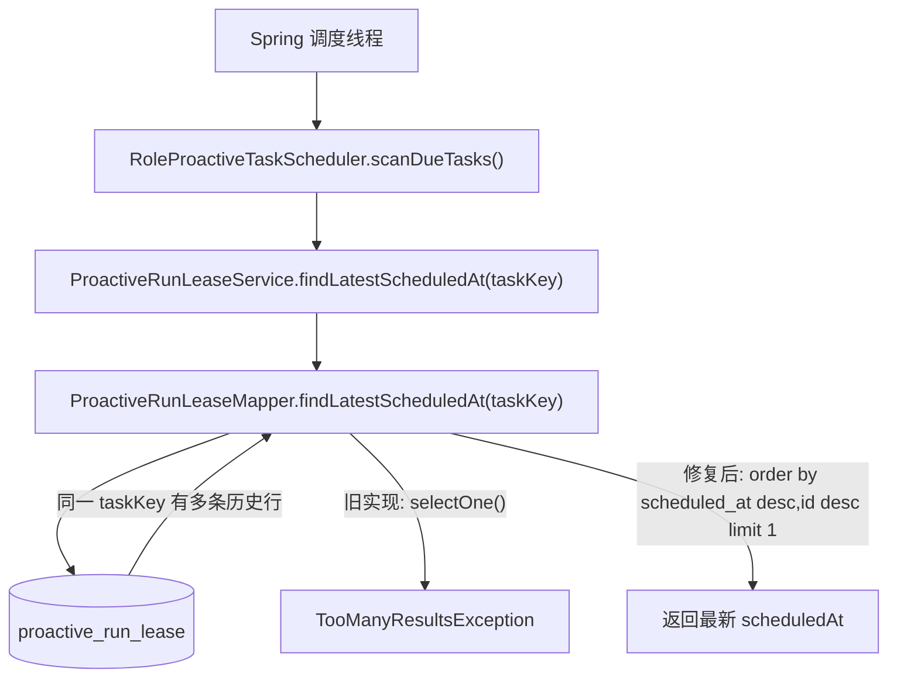
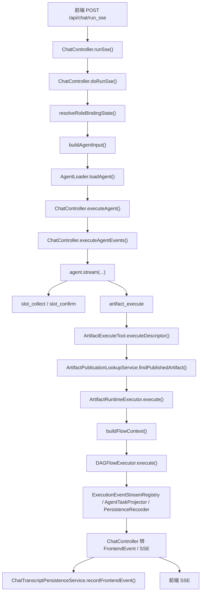
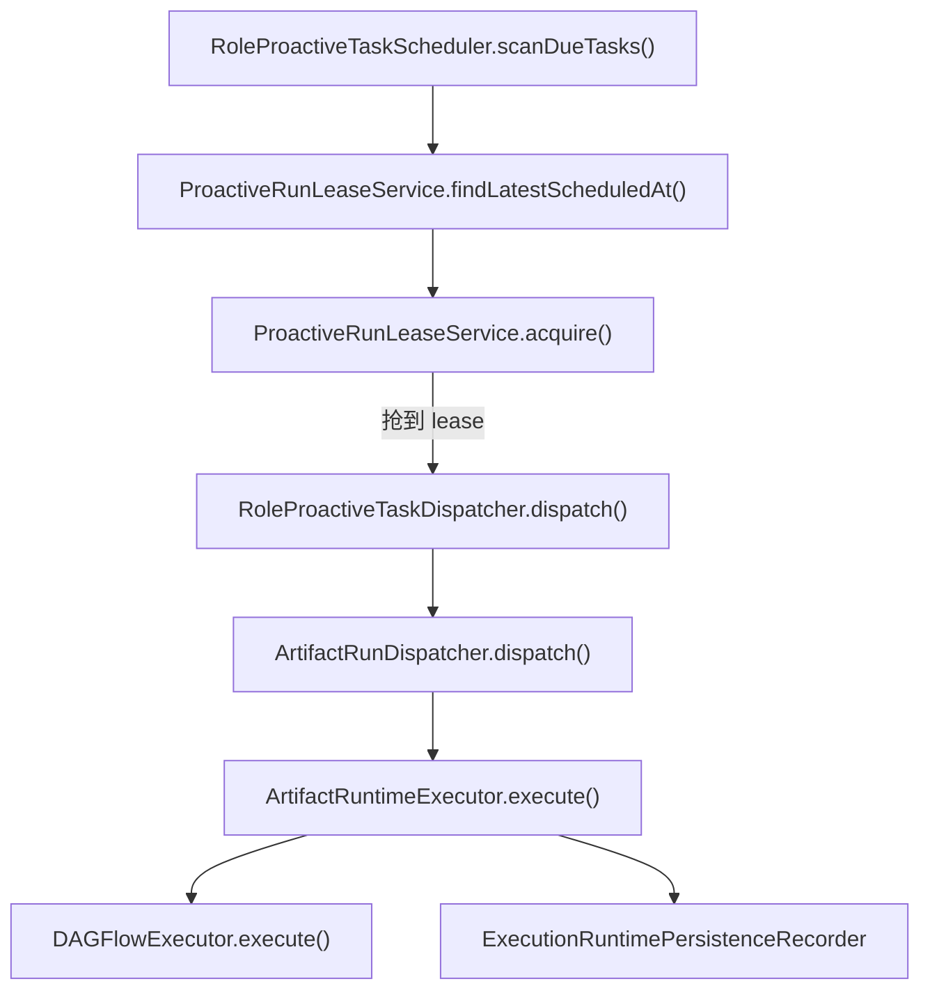

# 2026-03-19 Chat Runtime Flow Design

## 1. 启动阶段报错根因

`2026-03-19 13:43:32.060` 这条日志不是 Spring 容器本身启动失败，而是服务启动后，`@Scheduled` 的主动任务扫描第一次运行时抛出的异常。

- 表结构 `proactive_run_lease` 允许同一个 `taskKey` 保留多次历史调度记录，只要求 `(task_key, scheduled_at)` 唯一。
- 旧实现 `ProactiveRunLeaseMapper.findLatestScheduledAt(taskKey)` 用了 `selectOne(query)`。
- 当同一个 `taskKey` 已经有两次及以上调度历史时，MyBatis-Plus 会抛出 `TooManyResultsException`。
- 这就是日志里 `RoleProactiveTaskScheduler -> ProactiveRunLeaseService -> ProactiveRunLeaseMapper` 的异常链。

## 2. 用户对话到最终执行主链

这条链路走的是“对话驱动执行”路径，入口是 `/api/chat/run_sse`，真正落地执行统一收敛到 `ArtifactRuntimeExecutor`。

## 3. 主动任务执行链

这条链不经过 `ChatController`，是“定时扫描 -> 抢租约 -> 后台执行”的另一条支路。

## 4. 快速定位文件

- 对话 HTTP 入口：`assistant-api/src/main/java/com/alibaba/assistant/agent/api/controller/ChatController.java`
- 对话事件落库：`assistant-api/src/main/java/com/alibaba/assistant/agent/api/service/ChatTranscriptPersistenceService.java`
- Agent 系统提示词（要求走 `slot_collect -> slot_confirm -> artifact_execute`）：`assistant-runtime/src/main/java/com/alibaba/assistant/agent/runtime/agent/AgentPromptTemplateFactory.java`
- 用户确认后的统一执行出口：`assistant-runtime/src/main/java/com/alibaba/assistant/agent/runtime/tool/react/ArtifactExecuteTool.java`
- 企业动作/工作流执行核心：`assistant-runtime/src/main/java/com/alibaba/assistant/agent/runtime/execution/ArtifactRuntimeExecutor.java`
- 主动任务调度入口：`assistant-runtime/src/main/java/com/alibaba/assistant/agent/runtime/proactive/RoleProactiveTaskScheduler.java`
- 主动任务后台分发：`assistant-runtime/src/main/java/com/alibaba/assistant/agent/runtime/proactive/RoleProactiveTaskDispatcher.java`
- 主动任务异步执行桥：`assistant-runtime/src/main/java/com/alibaba/assistant/agent/runtime/execution/ArtifactRunDispatcher.java`
- 报错根因所在查询：`assistant-execution/src/main/java/com/alibaba/assistant/agent/execution/persistence/mapper/ProactiveRunLeaseMapper.java`
- 主动任务表结构：`assistant-infra/src/main/resources/db/migration/V40__create_proactive_run_lease_tables.sql`

## 5. 推荐阅读顺序

1. 先看 `ChatController.runSse -> doRunSse -> executeAgent`，知道请求怎么进入运行时。
2. 再看 `ArtifactExecuteTool.executeDescriptor`，知道模型什么时候从“对话”切到“执行”。
3. 然后看 `ArtifactRuntimeExecutor.executeInternal`，知道真正执行、事件、持久化在哪儿收口。
4. 如果排查启动后后台报错，再看 `RoleProactiveTaskScheduler.scanDueTasks` 和 `ProactiveRunLeaseMapper.findLatestScheduledAt`。
